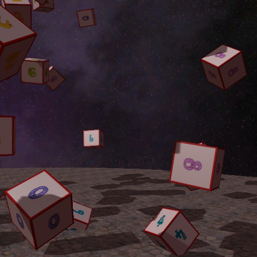
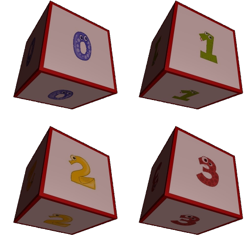

# DS2Horde

A Cython/Python wrapper for off-screen rendering with [Horde3D](http://www.horde3d.org/).

This is a sister project
of [DS2Server](https://github.com/olitheolix/ds2server) to provide interactive
3D visualisation for some machine learning fun.

*DS2Horde*'s off-screen rendering is based on
[this article](https://devblogs.nvidia.com/parallelforall/egl-eye-opengl-visualization-without-x-server/),
and thus requires an NVidia GPU.

NOTE: if you do not have an NVidia GPU, or only care about the training images,
you can still use [DS2Server](https://github.com/olitheolix/ds2server).
It contains a set of standalone training images, as well as a pre-rendered flight
through a 3D scene, with plenty of objects to find and classify in it.


## Installation
Since this is a Cython based wrapper for Horde3D, you will need Cython and
Horde3D first :)

To compile and install Horde3D, activate the virtual environment of your
choice, install Cython, and then type
```bash
git clone https://github.com/olitheolix/Horde3D
mkdir -p Horde3D/build
cd Horde3D/build
git checkout ds2
cmake .. -DCMAKE_BUILD_TYPE=RELEASE -DCMAKE_INSTALL_PREFIX=`python -c 'import sys; print(sys.prefix)'`
make install
```

The *DS2Horde* package itself is available on PyPi:
```bash
pip install ds2horde
```

# Usage
*DS2Horde* itself does not do much, since it is merely a wrapper. However, you
can re-create the training images that ship with *DS2Server*.

```bash
# Print help
ds2render -h

# Render 100 versions of each of the 10 cubes (1000 image total)
ds2render --num-images 100 cubes

# Render 100 frames from a flight through a 3D scene with 200 cubes
ds2render --num-images 100 --num-cubes 200 flight
```

Snapshot from Flight Through Scene | Training Images for Individual Cubes
:-------------------------:|:-------------------------:
  |  
